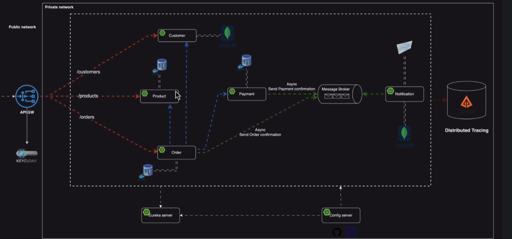

<div align="center">

# 🛒 E-Commerce Microservices Platform

### Une architecture microservices event-driven, sécurisée et observable — construite avec Spring Boot & Spring Cloud

[](https://openjdk.org/)
[](https://spring.io/projects/spring-boot)
[](https://spring.io/projects/spring-cloud)
[](https://www.docker.com/)
[](https://kafka.apache.org/)
[](https://www.keycloak.org/)
[](LICENSE)

**[Architecture](#-architecture)** · **[Flux de données](#-flux-de-données)** · **[Stack technique](#️-stack-technique)** · **[Installation](#-installation--lancement)** · **[Authentification](#-authentification)** · **[API](#-endpoints-disponibles)**

</div>

---

## 📖 À propos du projet

**E-Commerce Microservices Platform** est une application backend distribuée qui modélise un système e-commerce complet — gestion des clients, du catalogue produit, des commandes, des paiements et des notifications — en appliquant les patterns d'architecture microservices utilisés en production : **service discovery**, **configuration centralisée**, **API Gateway**, **communication hybride sync/async**, **sécurité OAuth2/JWT** et **distributed tracing**.

Le projet a été conçu comme un terrain d'expérimentation réaliste pour maîtriser les défis concrets des systèmes distribués : cohérence des données entre services, découplage via event-driven design, résilience, et observabilité.

> 💡 **Pourquoi ce projet ?** Chaque service a une base de données dédiée (*database-per-service*), communique via Feign/Kafka selon le besoin métier, et est protégé de bout en bout par Keycloak — reproduisant les contraintes réelles d'un environnement microservices en entreprise.

---

## 🏗️ Architecture

<div align="center">
  
  <p><em>Vue d'ensemble du système — réseau public/privé, routage via l'API Gateway, communication synchrone (rouge/bleu) et asynchrone via Kafka (vert)</em></p>
</div>

### Composants du système

| Microservice | Port | Base de données | Rôle |
| :--- | :---: | :--- | :--- |
| 🧭 **Config Server** | `8888` | – | Centralisation et distribution de la configuration |
| 🔎 **Discovery Server (Eureka)** | `8761` | – | Annuaire de services et découverte dynamique |
| 🚪 **API Gateway** | `8222` | – | Point d'entrée unique, routage, load balancing |
| 👤 **Customer Service** | `8090` | MongoDB | Gestion des clients |
| 📦 **Product Service** | `8050` | PostgreSQL (Flyway) | Gestion du catalogue produits |
| 🧾 **Order Service** | `8070` | PostgreSQL | Orchestration des commandes |
| 💳 **Payment Service** | `8060` | PostgreSQL | Traitement des paiements |
| 📧 **Notification Service** | `8040` | MongoDB | Envoi d'emails (consumer Kafka) |
| 🔐 **Keycloak** | `9098` | – | Authentification / Autorisation (OAuth2 / JWT) |
| 🕵️ **Zipkin** | `9411` | – | Distributed tracing |
| 📨 **Kafka** | `9092` | – | Bus d'événements asynchrone |

Chaque service applicatif suit le pattern **Database-per-Service** afin de garantir un couplage faible et une autonomie de déploiement complète.

---

## 🔄 Flux de données

### 1️⃣ Création d'une commande — vue d'ensemble

```
Client → API Gateway → Order Service
                          │
                          ├── Vérification du client      → Customer Service (sync)
                          ├── Vérification du stock        → Product Service  (sync)
                          ├── Persistance de la commande    → PostgreSQL
                          ├── Persistance des lignes         → PostgreSQL
                          ├── Déclenchement du paiement      → Payment Service (sync)
                          └── Publication d'un événement     → Kafka (order-topic)
                                                                    │
                                                                    ▼
                                                        Notification Service
                                                                    │
                                                                    └── Envoi d'un email de confirmation
```

### 2️⃣ Synchrone vs Asynchrone

| Type de communication | Services concernés | Mécanisme |
| :--- | :--- | :--- |
| 🔵 **Synchrone (HTTP)** | Order → Customer, Product, Payment | OpenFeign / RestTemplate |
| 🟢 **Asynchrone (Event-Driven)** | Order/Payment → Notification | Kafka (`order-topic`, `payment-topic`) |

Ce découplage permet au **Notification Service** de rester totalement indépendant du cycle de vie de la commande : en cas d'indisponibilité, les messages restent dans Kafka jusqu'à traitement, garantissant la résilience du système.

---

## 🛠️ Stack technique

<table>
<tr>
<td valign="top" width="50%">

**Backend**
- ☕ Java 17
- 🍃 Spring Boot 3.2.5
- ☁️ Spring Cloud (Config, Eureka, Gateway, OpenFeign)
- 🗃️ Spring Data JPA / Spring Data MongoDB
- 🔒 Spring Security + OAuth2 / JWT
- 📬 Spring Kafka
- ✉️ Spring Mail + Thymeleaf
- 🧬 Flyway (migrations SQL)
- ✨ Lombok

</td>
<td valign="top" width="50%">

**Infrastructure & Outils**
- 🐳 Docker / Docker Compose
- 🐘 PostgreSQL
- 🍃 MongoDB
- 📨 Apache Kafka + Zookeeper
- 🔐 Keycloak (IAM)
- 🕵️ Zipkin (distributed tracing)
- 📮 Postman (tests API)
- ✉️ MailDev (simulation SMTP)

</td>
</tr>
</table>

---

## 📦 Prérequis

| Outil | Version minimale |
| :--- | :--- |
| Java (JDK) | 17+ |
| Maven | 3.8+ |
| Docker & Docker Compose | Dernière version stable |
| Postman | Pour les tests API |

---

## 🚀 Installation & lancement

### 1. Cloner le projet

```bash
git clone https://github.com/votre-utilisateur/e-commerce-microservices.git
cd e-commerce-microservices
```

### 2. Démarrer l'infrastructure

```bash
docker-compose up -d
```

Cette commande provisionne : **PostgreSQL**, **MongoDB**, **Kafka & Zookeeper**, **MailDev**, **Zipkin**, **Keycloak**.

### 3. Démarrer les microservices

> ⚠️ L'ordre ci-dessous respecte les dépendances de démarrage (config avant discovery, discovery avant les services métier).

```bash
mvn spring-boot:run -pl config-server
mvn spring-boot:run -pl discovery-server
mvn spring-boot:run -pl customer-service
mvn spring-boot:run -pl product-service
mvn spring-boot:run -pl order-service
mvn spring-boot:run -pl payment-service
mvn spring-boot:run -pl notification-service
mvn spring-boot:run -pl gateway-service
```

### 4. Configurer Keycloak

1. Accéder à la console d'administration : `http://localhost:9098`
2. Se connecter avec `admin` / `admin`
3. Créer un **Realm** : `micro-service`
4. Créer un **Client** : `microservices-api` avec *Client Authentication* activé
5. Récupérer le **Client Secret** depuis l'onglet *Credentials*

---

## 🔐 Authentification

L'**API Gateway** protège l'ensemble des endpoints (à l'exception de `/eureka/**`) via un mécanisme OAuth2 / JWT centralisé sur Keycloak.

### 1. Obtenir un token JWT

| | |
| :--- | :--- |
| **URL** | `http://localhost:9098/realms/micro-service/protocol/openid-connect/token` |
| **Méthode** | `POST` |
| **Body** (`x-www-form-urlencoded`) | `client_id=microservices-api`<br>`client_secret=<votre-client-secret>`<br>`grant_type=client_credentials` |

### 2. Utiliser le token

```http
GET /api/v1/products
Authorization: Bearer <votre-token>
```

---

## 📋 Endpoints disponibles

| Méthode | Endpoint | Service | Description |
| :---: | :--- | :--- | :--- |
| `POST` | `/api/v1/customers` | Customer | Créer un client |
| `GET` | `/api/v1/customers/{id}` | Customer | Récupérer un client |
| `POST` | `/api/v1/products` | Product | Créer un produit |
| `GET` | `/api/v1/products` | Product | Lister les produits |
| `POST` | `/api/v1/orders` | Order | Créer une commande |
| `GET` | `/api/v1/orders` | Order | Lister les commandes |
| `GET` | `/api/v1/orders/{id}` | Order | Récupérer une commande |
| `GET` | `/api/v1/order-lines/order/{id}` | Order | Lignes d'une commande |
| `POST` | `/api/v1/payments` | Payment | Traiter un paiement |

---

## 📧 Emails (MailDev)

Les emails envoyés par le **Notification Service** sont interceptés localement — aucun envoi réel n'est effectué en développement.

🔗 Interface web : `http://localhost:1080`

---

## 🔍 Distributed Tracing (Zipkin)

Chaque requête traversant le système peut être tracée de bout en bout, service par service, pour diagnostiquer latences et erreurs.

🔗 Interface web : `http://localhost:9411`

---

## 🧪 Tests avec Postman

1. Importer la collection Postman fournie (si disponible dans `/postman`)
2. Configurer l'authentification **OAuth2** avec le `client_id` et `client_secret` de Keycloak
3. Tester les endpoints protégés via le token généré automatiquement

---

## 📁 Structure du projet (monorepo)

```
e-commerce-microservices/
├── config-server/
├── discovery-server/
├── gateway-service/
├── customer-service/
├── product-service/
├── order-service/
├── payment-service/
├── notification-service/
├── docker-compose.yml
└── README.md
```

---

## 🔧 Roadmap / Améliorations possibles

- [ ] Ajouter un **Circuit Breaker** (Resilience4j) pour la résilience inter-services
- [ ] Implémenter le **Saga Pattern** pour les transactions distribuées
- [ ] Centraliser les logs avec la stack **ELK** (Elasticsearch, Logstash, Kibana)
- [ ] Déployer sur **Kubernetes**
- [ ] Ajouter des tests unitaires et d'intégration (JUnit 5, Testcontainers)
- [ ] Gérer les rôles utilisateurs (`ADMIN`, `USER`) dans Keycloak
- [ ] Mettre en place un pipeline **CI/CD** (GitHub Actions)

---

## 👨‍💻 Auteur

**Yassine Bahadi**
Élève-ingénieur en Génie Logiciel & Systèmes Distribués — ENSET Mohammedia

[](https://github.com/votre-utilisateur)
[](https://linkedin.com/in/votre-profil)

---

## 📄 Licence

Ce projet est distribué sous licence **MIT**. Voir le fichier [`LICENSE`](LICENSE) pour plus de détails.

<div align="center">

⭐ **Si ce projet vous a été utile, n'hésitez pas à lui laisser une étoile !**

</div>